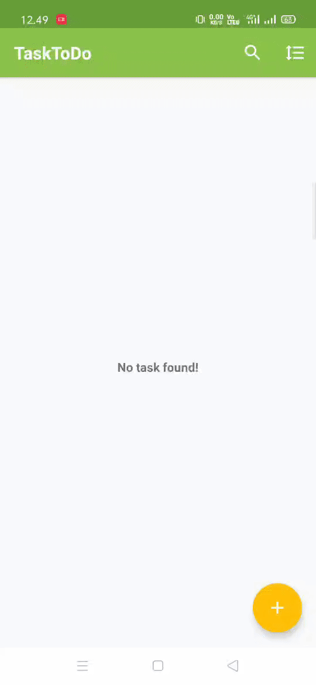
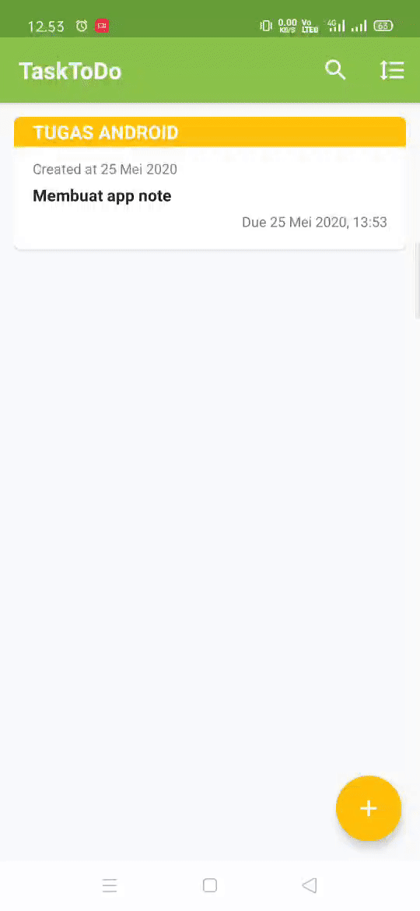

# Task To Do
Android App Task Note and Reminder using Room Database and MVVM Architecture
APK Download Here: https://drive.google.com/drive/folders/1vUa8Ph6EI2XBaWGTKbh9BMoy406Pehie?usp=sharing

# Feature
- Create Task & Reminder 1 Hour Before Task

- Read, Update & Delete Task

- Search Task & Sort Task By Created Date and Last Updated Date

